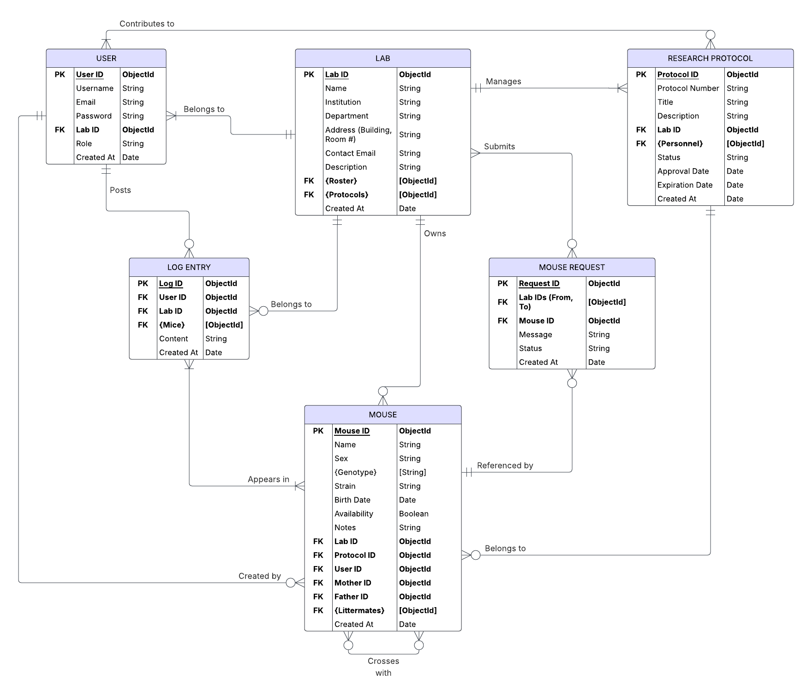

# Mouse Colony Manager

A full stack web application that helps research labs collaboratively manage mouse colonies, track genotypes and research protocols, and share mice across labs within the same institution.

---

## Features

- User registration and authentication
- Lab-level mouse management
- Protocol-based organization
- Genotype/strain tracking
- Log entries for mouse activity
- Cross-lab mouse sharing requests

---

## ER Diagram

---

## Tech Stack

- **Frontend**: React, Bootstrap
- **Backend**: Node.js, Express
- **Database**: MongoDB, Mongoose